# Lab 2: IPSec VPN

## Introduction

Local VCN peering is the process of connecting two VCNs in the same region so that their resources can communicate using private IP addresses without routing the traffic over the internet or through your on-premises network. The VCNs can be in the same Oracle Cloud Infrastructure tenancy  or different ones. Without peering, a given VCN would need an internet gateway and public IP addresses for the instances that need to communicate with another VCN.

## Objective

This lab walks you to the steps needed to create a hub and spoke topology. We will reuse the resources created in the previous labs.

## Pre-requisites

To perform this lab, you must finish the first two labs

## Process Overview

- [Create Spoke VCN](#create-spoke-vcn)
- [Create Routing for the VCN Peering](#create-routing-for-the-vcn-peering)
- [Create VCN peering](#create-vcn-peering)
- [Adjust Routing for the connectivity](#adjust-routing-for-the-connectivity)
- [Test the Connectivity](#test-the-connectivity)

## Create Spoke VCN

Navigate to Networking > Virtual Cloud Networks  and create a new VCN

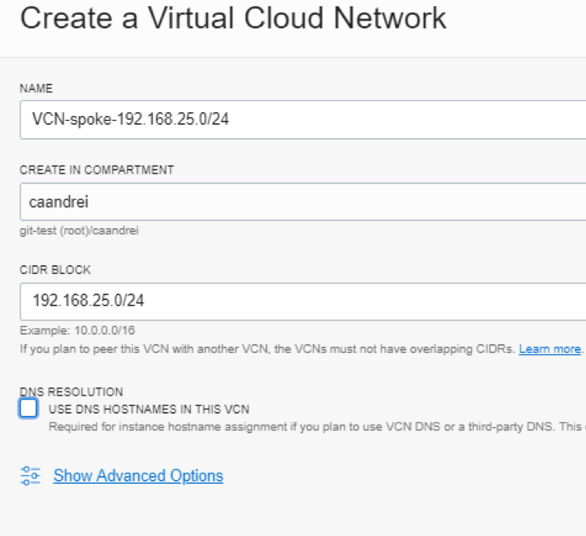

Create a private subnet

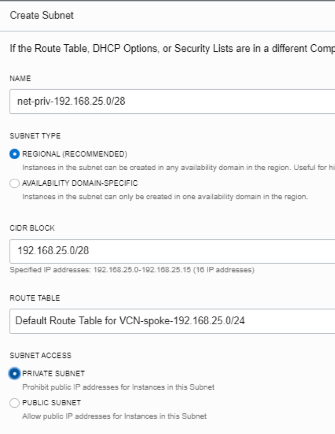

## Create Routing for the VCN Peering

Navigate to Networking > Virtual Cloud Network > {VCN from the second Lab} > Route Tables and create a two new Route Tables

- Rt-drg
- Rt-lpg-hub

Associate the rt-drg to the DRG

Navigate to Networking >Dynamic Routing Gateway, click on the DRG and under the Virtual Cloud Networks associate the route table

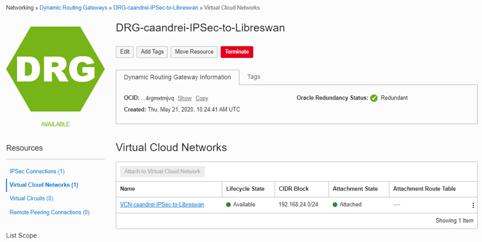

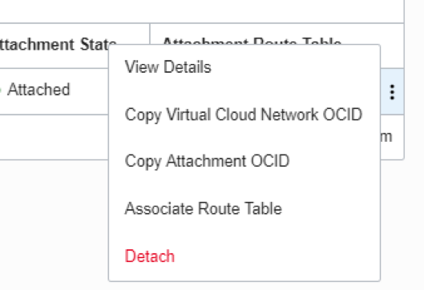

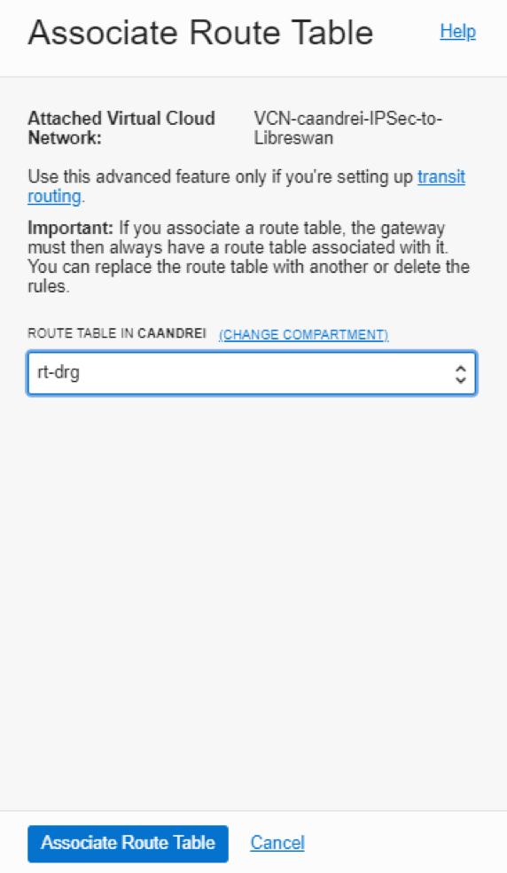

## Create VCN peering

Navigate to Networking > Virtual Cloud Network > {VCN from the second Lab} > Local Peering Gateways and create a LPG. Under Advanced Options, associate the route table created earlier

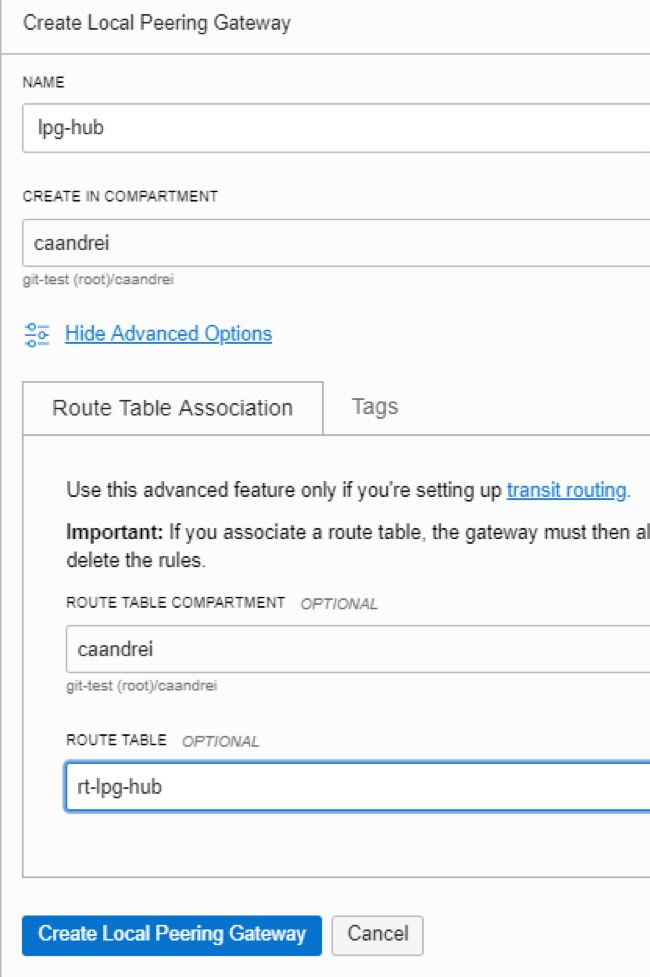

In the rt-lpg-hub add a route for the subnets that are behind the Libreswan (192.168.23.0/24)

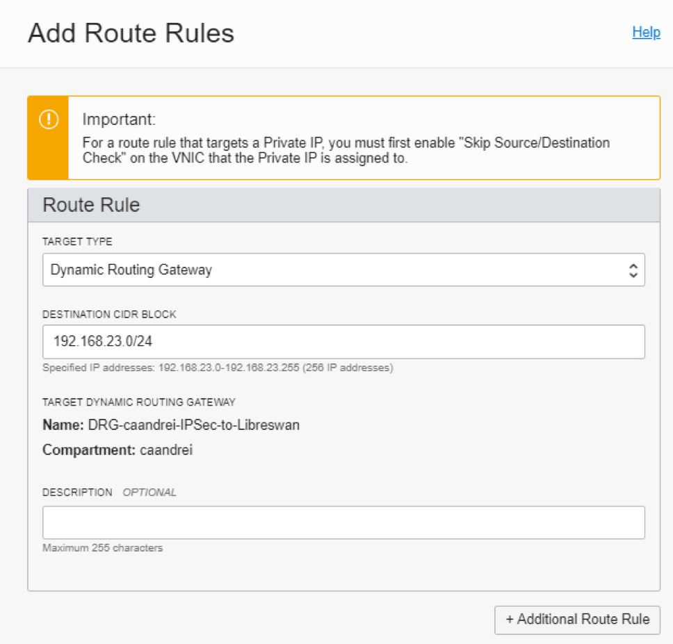

In the rt-lpg-drg add a route for the subnets that are in the spoke VCN (192.168.25.0/24)

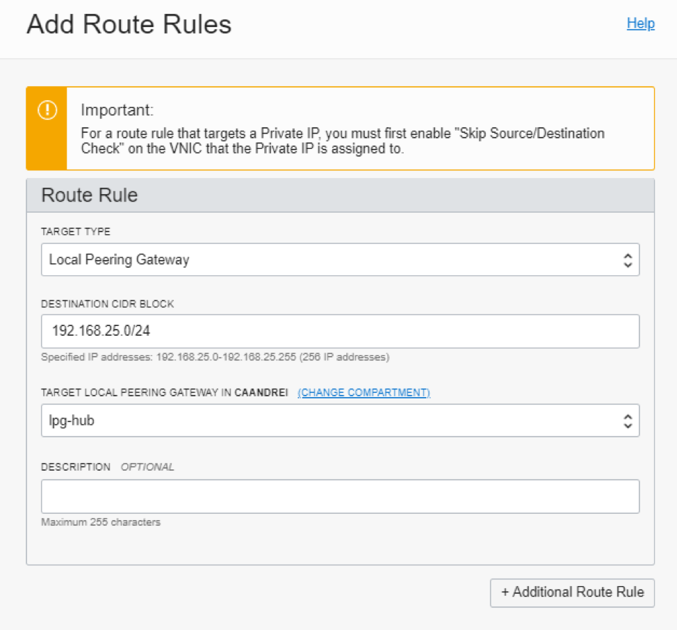

Navigate to Networking > Virtual Cloud Network and click on the spoke vcn created.

Go under Local peering gateways and create a new LPG. Establish peering Connection with the hub lpg

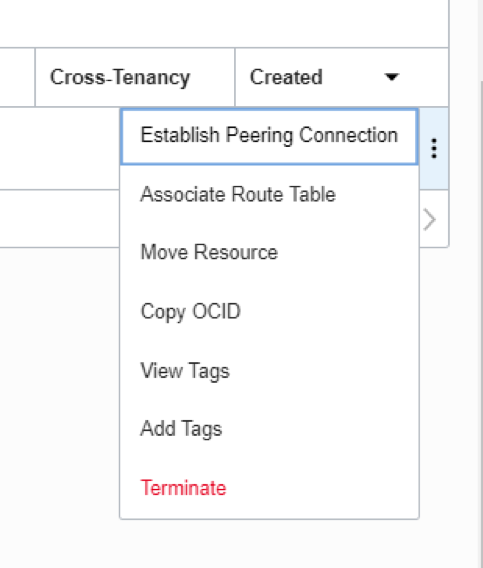

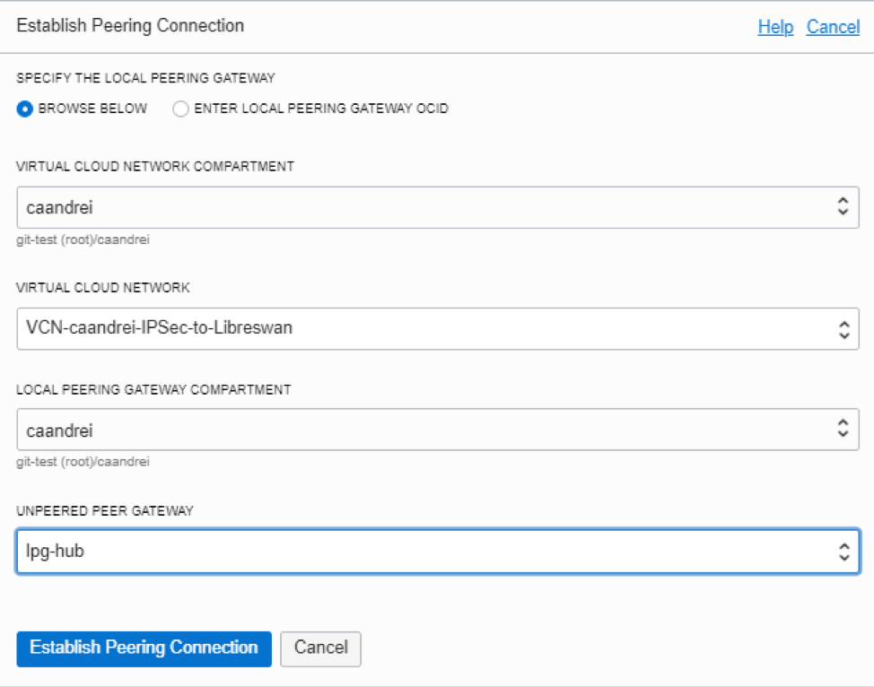

The LPG will receive a summary route of the hub vcn CIDR and the CIDR space of the VCN that Libreswan is located

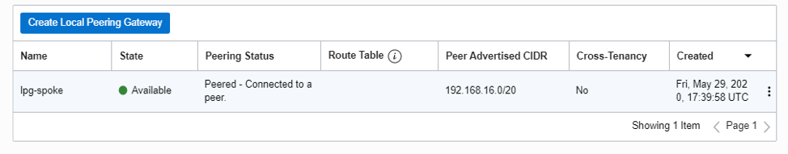

Modify the Default route table of the spoke vcn and add a default route to the spoke lpg

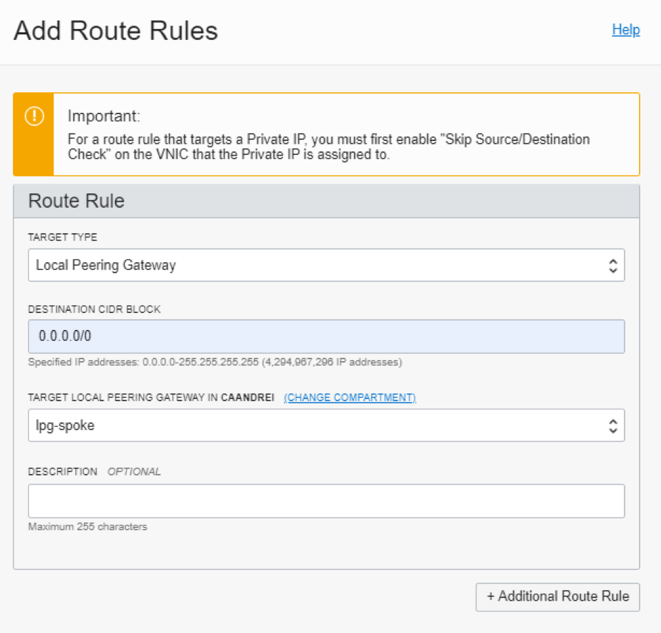

## Adjust Routing for the connectivity

Let's adjust routing for cooncetivity from 192.168.23.0/24 to 192.168.24.0/23 

Connect to the Libreswan VM and in quagga check the received routes

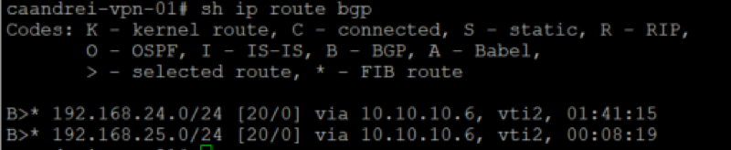

Observe that we are receiving the spoke vcn routes

Navigate to the Libreswan VCN and create a routing table for the private subnet. Add a route entry for the CIDR space that is behind the DRG:

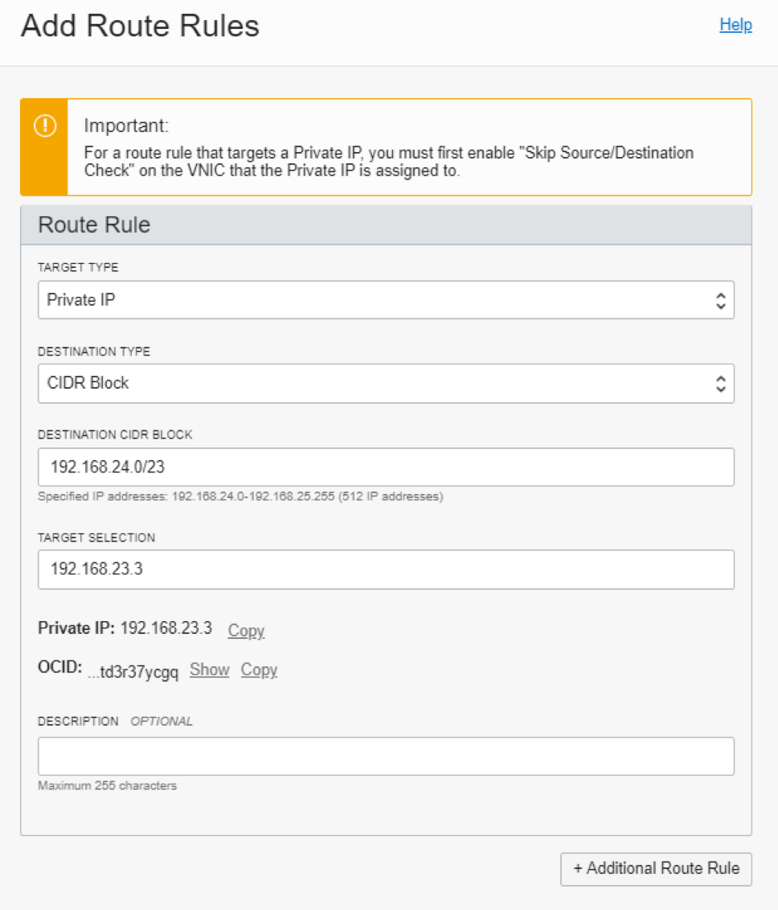

Notice the error message

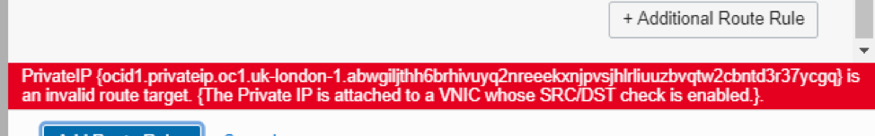

We need to change the VNIC of the Libreswan VM.

Navigate to Compute >  Instances > Libreswan VM. Navigate to the Attached VNICs.

Edit the VNIC and check “Skip source/destination check”

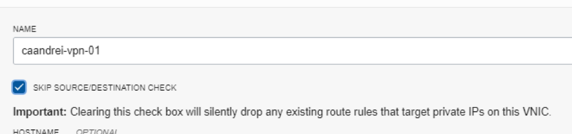

Navigate back to the route table and re-add the routing rule

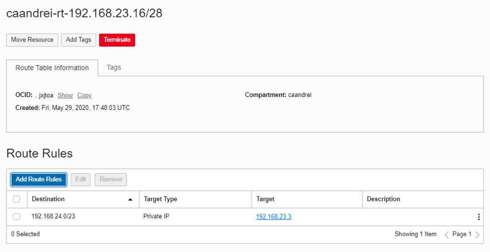

Navigate to Networking > Virtual Cloud Network > caandrei-vcn-192.168.23.0/24

Click on the private subnet and edit the subnet and select the routing table

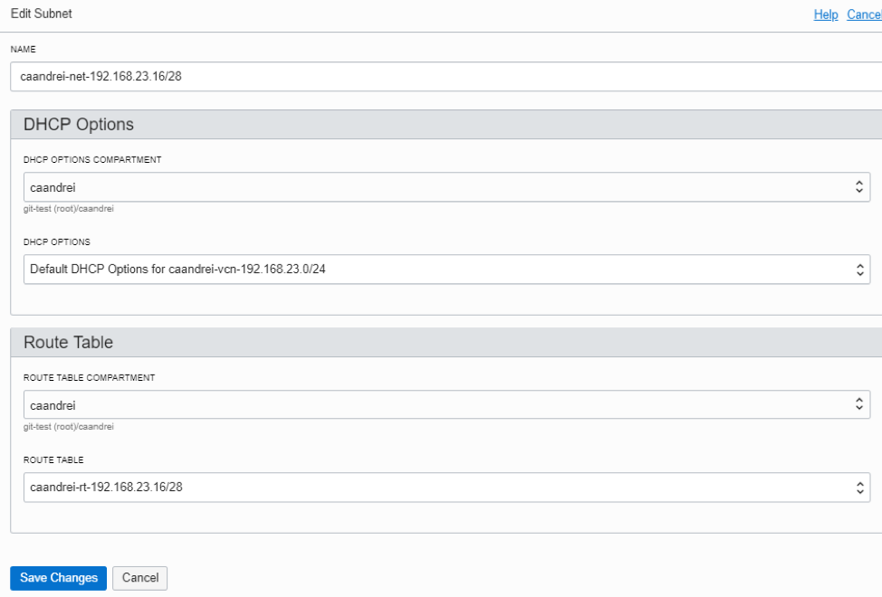

Navigate to the region where the DRG is and create a compute VM in the spoke VCN.

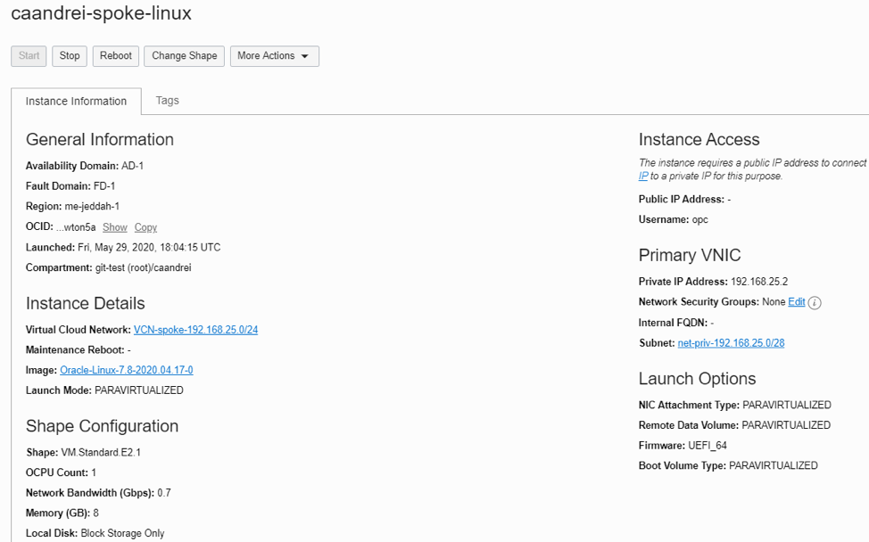

## Test the connectivity

Connect to the private VM that is behind the Libreswan. Create the private key (use the same steps from lab1)

Connect from the Private VM to the spoke VM

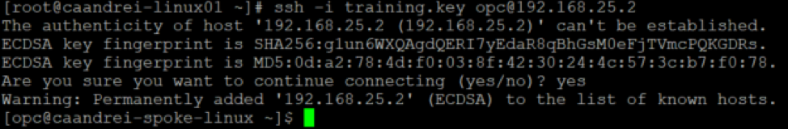

Observe that we connected to the spoke VCN