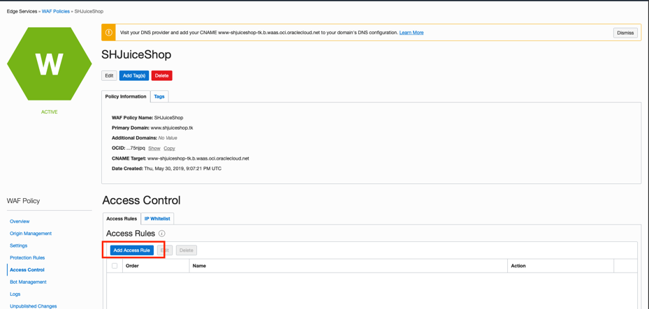
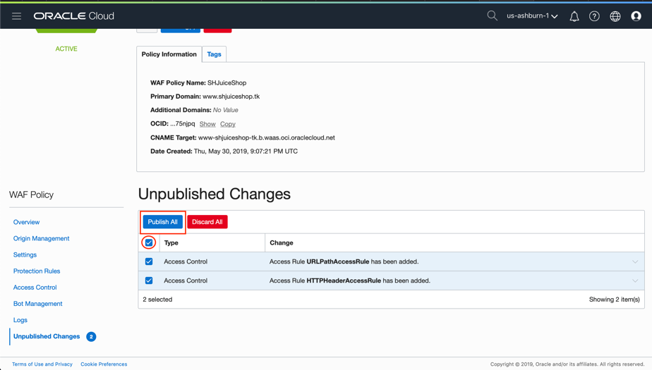
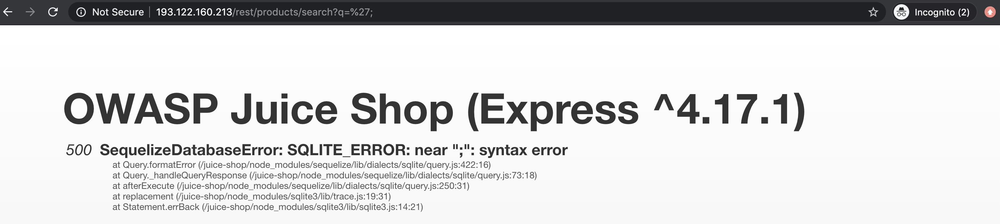

# Lab 4: Edge Services - Web Application Firewall Workshop

## Objectives of the workshop

1. Host the JuiceShop application on OCI VM
2. Domain name setup and DNS configuration in freenom.com.
3. Setup a Web Application Firewall (WAF) Policy on OCI for a Web app to clearly demonstrate the role of a WAF.
4. Setup Access Control Rules to detect, log and block access to the Web Application using invalid URL and HTTP Headers.
5. Test the Access Rules.
6. Setup Protection Rules in the WAF policy to protect Web Application from targeted attacks like Cross-site scripting, SQL Injection etc.
7. Test the protection rules.
8. Setup JavaScript Challenge in Bot Management Policies
9. Test JavaScript Challenge using cURL utility and the browser.

## Workshop Prerequisites

1. A OCI VCN with public subnet and access to Internet
2. OCI Account with access to manage WAF Policies.
3. Google Chrome browser – required to test Header based Access Rule for the web application.
4. One Different Browser to test the use cases for the unprotected web application (i.e. when we directly access the web application we setup using the compute instance’s public IP address) – recommended but not required as we can use incognito mode/Add People feature in Google Chrome.
5. cURL utility or Postman client.

## Sections

- [Host the JuiceShop application on OCI VM](#host-the-juiceshop-application-on-oci-vm)
- [Domain name setup and DNS configuration in Freenom](#domain-name-setup-and-dns-configuration-in-freenom)
- [Setup Web Application Firewall Policy on OCI](#setup-web-application-firewall-policy-on-oci)
- [Setup Access Control Rules](#setup-access-control-rules)
- [Test the Access Rules](#test-the-access-rules)
- [Setup Protection Rules](#setup-protection-rules)
- [Test Protection Rules](#test-protection-rules)
- [Setup JavaScript Challenge in Bot Management](#setup-javascript-challenge-in-bot-management)
- [Test JavaScript Challenge](#test-javaScript-challenge)

## Host the JuiceShop application on OCI VM

Let us first create a Virtual Machine in a public subnet of your VCN. Log in to OCI console and navigate to Compute  --> Instance


Click *Create Instance* and select Oracle Linux with any avaialble shape. Select your VCN, the corresponding public subnet, pass your SSH public key, and click *Create*


SSH into the VM and run the following commands to install docker

```bash
ssh -i <private-key> opc@<public-ip-of-vm>
```

```bash
sudo yum install docker-engine
sudo systemctl start docker
sudo systemctl enable docker
```

Run the following command to pull the [JuiceShop](#https://github.com/bkimminich/juice-shop) docker image and run the application on port 80

```bash
docker run –d -p 80:3000 bkimminich/juice-shop
```

Now navigate to the public subnet of your VCN, select its security list and add stateful ingress port 80 for it be accessible over the internet


The application should be accessible if you open a browser and enter the IP of the host machine.


## Domain name setup and DNS configuration in Freenom

Let visit freenom.com and register a free domain (usually .tk, .gq, .cf etc) and also use their own DNS service to add a DNS A Record and CNAME Record for the registered domain. If you have the domain name setup and mapped to the origin hosting the Web application, then you can move onto next section.

Create an account, login and search if the domain you wish to register is available. In this workshop, I   will be using the domain [networkinglab.tk](#) which is registered with freenom. In this workshop when we are testing out the WAF Policies, replace the [networkinglab.tk](#) with the domain name that you create with freenom


Select the time period depending on how long you wish to keep the domain name and then click on continue


We can use Freenom’s DNS service to direct any traffic for your domain to the IP address of your web application. Essentially it is mapping your domain name to the IP address of the machine hosting the Web Application

This mapping is called a DNS A Record and this record can be added on freenom’s DNS Management console or your DNS providers management console

Below screenshot shows creation of A records while we are registering the domain. Enter the public IP of the VM we just created under both the IP address fields.


Once you complete the process, the domain should be active in a few minutes. If you’ve used the DNS Service by Freenom then you can check the DNS settings under Manage Domain -> Manage Freenom DNS. 

Below screenshot shows the configured A records for the registered domain. Make sure you have two records, if not, you can edit and save changes.


The domain is now setup and ready to be used to setup a WAF Policy on OCI

Visit your domain with *[www.\<your-domain-name\>.tk](#)* and it should point to your juice shop application


## Setup Web Application Firewall Policy on OCI

On the OCI console, navigate to WAF Policy by clicking on the hamburger menu -> Security -> WAF Policies


Click on Create WAF Policy. Enter the domain name and URI for the web application


Once WAF policy is created a property called CNAME target gets created. It consists of a hyphenated version of the domain name

Use this CNAME target and modify the DNS Settings in DNS Service Provider management console. If you are using the domain registered and DNS managed by freenom, the screenshot below shows the changes to be made.

Under target column for the www A Record, remove the IP address of the host and add the CNAME Target of the WAF Policy to route incoming traffic through the WAF for the Web application


Before we move to the protection rules, let us take a look at the Access Control Rules to have a restricted access to the web application

## Setup Access Control Rules

For this, we can use a simple webpage and use a simple Webserver like Apache to host the sample web page

Click on the created WAF Policy to view more information about it and to configure Access Control rules. Click on Access Rules from the options menu on the left side of the OCI WAF console


Click on Add Access Rule. Let us add an Access Rule that blocks users trying to access the web-application with unwanted parameters in the URL by showing an error page with appropriate message and description



Give a name to the Access Rule. Under Conditions, from the rule conditions dropdown select URL is option and specify /foo under URL Address. This is going to block any access to you web application origin with the URL *[http://www.\<your-domain-name\>/foo](#)*


Under Actions select Block as Rule Action. From the Block Action Dropdown select Set Error Page. Enter the appropriate values for the Error Page that should be displayed when this rule is triggered. Click on Add Access Rule


Let’s add another Access Rule. Click on Add Access Rule and give the name HTTPHeaderAccessRule. We will block access to the web application for any request with the header key ***name*** and value ***blockme***. We can use MOD Header browser extension for Google Chrome to test this one out. For Rule Action, we select Block, same as previously created Action Rule. For Block Action select Show Error Page and enter appropriate Error message and description. Click on Add Access Rule


Now we have to publish the changes to the WAF policy. Navigate to Unpublished Changes. Click on the Publish All Button.



Publishing of these changes takes around 10 mins. Once the changes are published we can test the Access Rules in action.

## Test the Access Rules

We can test the first access rule of the URL path y opening a browser to visit www.\<domain>/foo. This should take you to an error page as shown in the screenshot below


To test the HeaderAccessRule, we can use a Google Chrome browser extension called ModHeader. Once added to Google Chrome, open the extension and enter name for Name and blockme as Value as the request headers. This will append name:blockme as the header for our next request when we open *[www.\<your-domain-name\>](#)*


When we try to open the web application by hitting the domain name we’ll be shown an error page because of the HeaderAccessRule we created


## Setup Protection Rules

Now let's setup protection rules in the WAF policy to protect Web Application from targeted attacks like Cross-site scripting and SQL Injection

Setup Protection Rules for Cross-Site Scripting attacks and manually test the rules in action by running the web application in 2 different browsers (one accessing web application directly using the instance IP and the other accessing the web application through the WAF Policy)

Go into the WAF policy that was created in Section 2. Navigate to Protection Rules from the panel on the lower left side of the WAF policy detail page


Under the Rule ID Filters look up for rules with the following ID’s – 950006, 941140, 950907, 981242(981243), 981272, 950007, then use the check box under Actions button to select all filtered results and change status to Block


Navigate to Unpublished changes. Check box under Publish All button and click on the Publish All button. It will take a few minutes to publish these changes. Once the WAF policy status is active, we can test the Protection Rules manually

## Test Protection Rules

To test the Cross-Site Scripting Protection Rule with No WAF, enter URL of the web application with the IP Address instead of the domain name – *[http://193.122.160.213?id=\<script>alert("TEST");\</script>](#)*. The application opens which is not a desired outcome as there was an unchecked script passed into the browser


Now try to access the web application using the domain name - *[http://www.networkinglab.tk?id=\<script>alert("TEST");\</script>](#)*. As the traffic is redirected to the WAF Policy CNAME target on OCI, which recognizes the script injected into the URL because of the rules we setup for protection against Cross-site scripting attacks in the previous section. We are redirected to an error page as shown in the screenshot below

Make sure you have removed the MODHeader that was added to test Access Rule in the previous section. Or else we’ll be shown the error page for the HeaderAccessRule we setup instead of the 403 Forbidden Error page shown in the screenshot below


Next, we can check the Protection Rules for a SQL Injection attack. We can perform a similar test where we access both protected and unprotected Web applications

In a browser tab open the URL of web app with IP Address followed by /rest/products/search?q=oranges. *[http://193.122.160.213/rest/products/search?q=oranges](#)*. When we open this URL we can see from the screenshot below that a result is being shown thus meaning the SQL was passed and successfully run


Now this was a valid input and we got the result for it from both but now instead of a valid input, when we change the search parameter to a random string '; *[http://193.122.160.213/rest/products/search?q=';](#)* we get a SQLLITE Error which is suggestive of the possibility of an SQL Injection Attack



By fixing the query parameter to ‘))-- and running the URL on a browser again *[http://193.122.160.213/rest/products/search?q='))--](#)*  will display all the results thus showing the SQL Injection attack is done


When we try the same query parameter on the WAF policy protected end-point i.e accessing web application using domain name *[http://<your-domain-name>/rest/products/search?q='))--](#)*, then we get the following error page


We can see the WAF Policy Logs to confirm this was the action of the Protection Rules we setup. Navigate to Logs from the left side panel. For the Log with the Block action, expand to view its details. Then click on the View JSON button


From the above JSON we can see the protection rules that was triggered which blocked the access of the web application as its action. The search parameters and the matched attack string were also captured in the logs

## Setup JavaScript Challenge in Bot Management

From the left panel on the WAF policy page on OCI, select Bot Management. Click on Edit JavaScript Challenge


Check on the box Enable JavaScript challenge


Change Action to Block and change Block Action Show Error Page


Scroll down and edit the Error page message and description and change Action Threshold to 6 requests. Click on Save


Publish the changes

## Test JavaScript Challenge

Once the JavaScript challenge is published and WAF Policy is back to active, open a terminal window and enter the command. Use the public IP of the instance running the web application

```bash
curl http://<your-ip-address>
ex.
curl http://193.122.160.213
```

Execute the above command in a quick succession 8-9 times. We can still see the response returned is index.html for the Web application


Now execute the following command in quick succession for 8-9 times

```bash
curl http://www.<your-domain-name>
ex.
curl http://www.networkinglab.tk/
```

We can see the JavaScript challenge that was enforced by the WAF Policy. Beyond 6 requests (threshold) we can see that we are being returned a 403 Forbidden Error.


We can check the logs for the JavaScript challenge from the Logs section on the left side panel as well.


To learn more about Oracle WAF click [here](#https://docs.cloud.oracle.com/en-us/iaas/Content/WAF/Concepts/overview.htm)
